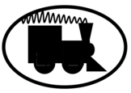
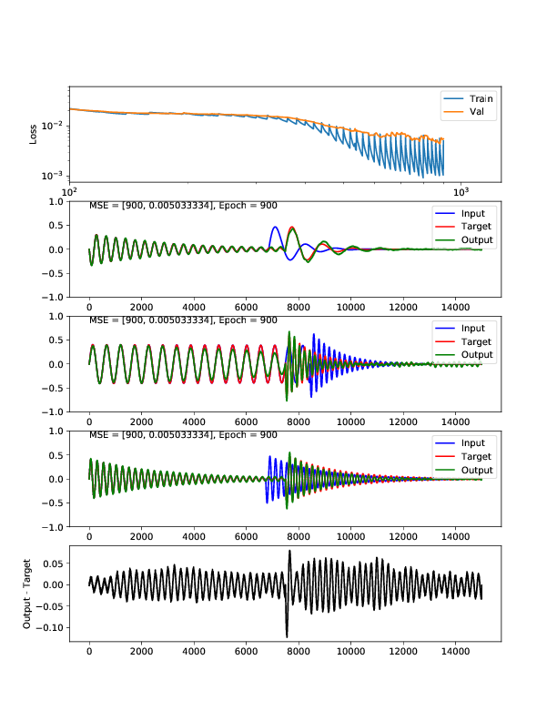

# SignalTrain

Learning audio effects with neural networks

### Installation:
I use Anaconda, with Python 3.6, and Pytorch 0.4, on Mac OSX and Linux (Ubuntu 16.04).  
This has not been tested in other ways.  Here's how I do a fresh install, e.g. into a 'test_st' environment:
```
conda create -n test_st python=3.6
source activate test_st
git clone https://github.com/drscotthawley/signaltrain.git
cd signaltrain
pip install -r requirements.txt
```
Test it (with a small run, usuall I run much larger):
```
./train.py --length 150000 --batch 10
```


### Running:
`python train_signaltrain.py` or `./train_signaltrain.py`

(Run with `--help` for list of command-line options.)

Progress updates will be written to `progress0*` files, including `progress0.pdf`, which may look like this:


### Directory Structure:
```
signaltrain/    The main library
    +--- models.py      Where the pytorch classes & associated routines are
    +--- audio.py       Utilities related to audio production, effects, & more
    +--- utils.py       Grab bag of other utilities
docs/                   Not much here at the moment
experiments/    Where I do various runs and report on them. Look here! :-)
```

### TODO:
* [x]  Make checkpoint of 'id' (Autoencoder) 'effect' to use for (optionally) initializing network.
* [ ]  More effects!  Added `sox` support (write to file, calls sox, reads another file).  Currently no working Python VST hosts, but [one is in development](https://github.com/igorgad/dpm).
* [ ]  Better visualization of weights & data, e.g. via [tensorboard](https://github.com/yunjey/pytorch-tutorial/tree/master/tutorials/04-utils/tensorboard) (with or without [tensorboardX](https://github.com/lanpa/tensorboard-pytorch)), [visdom](https://github.com/facebookresearch/visdom) or [Crayon](https://github.com/torrvision/crayon)
* [ ]  Write a Dataset generator class, e.g. via pytorch's [torchaudio](https://github.com/pytorch/audio)
* [ ]  Try mu-law companding to see if it improves SNR
* [ ]  Add parameterized controls, e.g. by concatenating in the middle of the network.
* [ ]  A wavenet architecture?
* [ ]  Try replacing MSE loss with an audio classifier and turn this into a GAN?  (Note: tried [a simple version of this idea](https://gist.github.com/drscotthawley/f0ecdc49d1c98d20dae26eb115b044b8) which didn't work out. Maybe I'm doing it wrong?)


#### History:
Previously this repo was named "fxlearn".  Revised name "SignalTrain" suggested by [Rex Paul Schnelle](https://rexmusic.us/).
