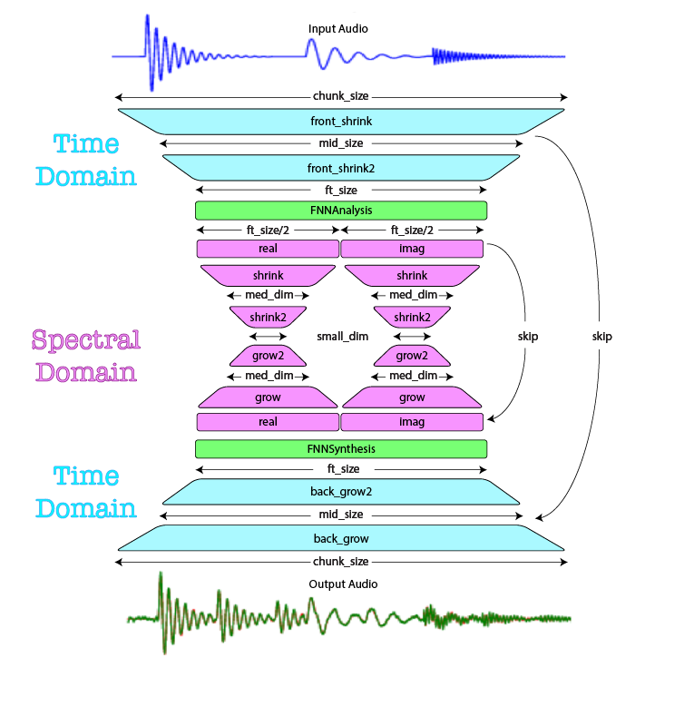

Here we have, not proper documentation yet, just a list of notes as I
develop the system.

Here's a picture of the 'Spectral Shrink-Grow' model, which follows the
notation of some people, in which inputs are on the bottom and outputs
are on the top.  (I prefer left to right, but it's easier to fit the text
with a vertical flow!)

