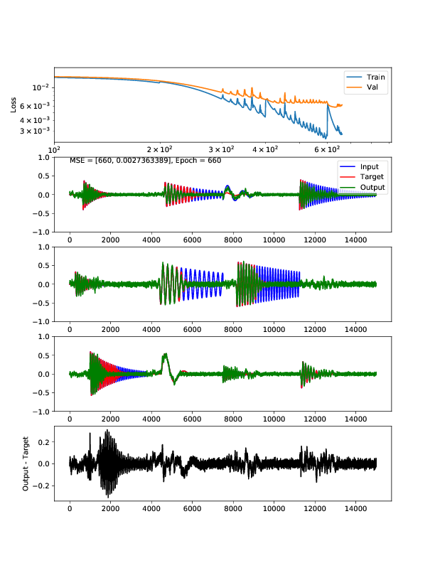

 Note: I say "compressor" instead of "compression", only to distinguish this dynamic-range compression from "data compression".
 
 For the longest time, this particular effect was un-learnable by any means I tried. 
 Last night I added skip connections and finally started getting something:  
 
 
 
 More work is needed. 
