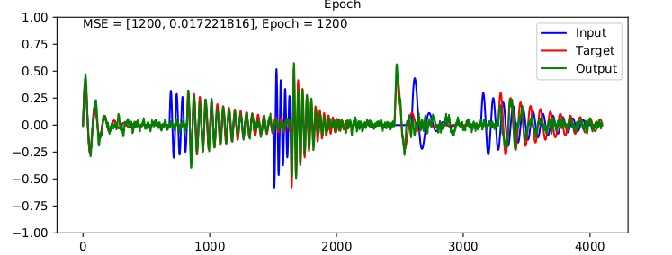
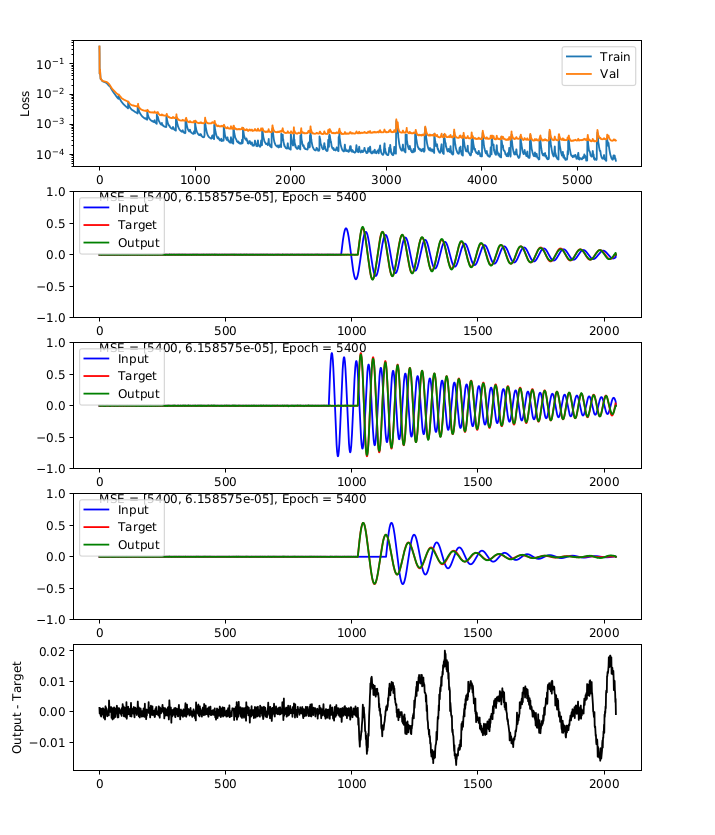
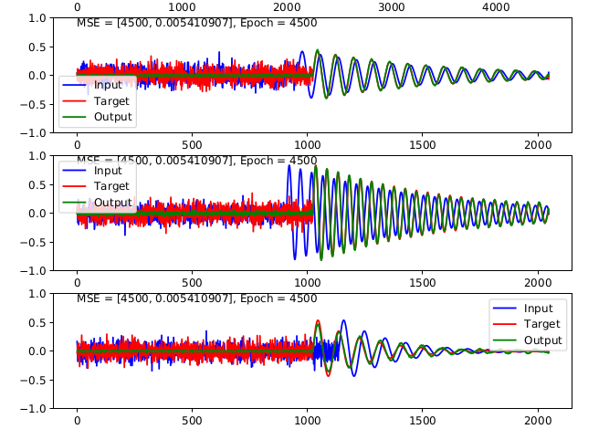
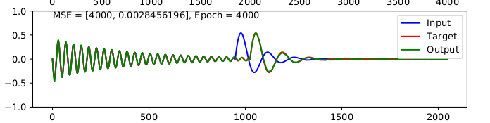
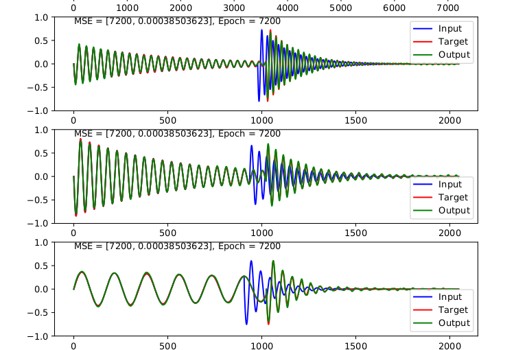

First attempt: with multiple, randomly-placed 'plucks'.  Red is "on the grid".

That seemed hard, so decided to focus on just one event, which 'should' be in the middle of window:

Ok, so that worked, so what about if it's not preceded by silence?  Here's noise:

...interesting that it doesn't learn the noise.  That's ok.

In reality, though, there will be a precding event.  In this case, interestingly, when the random event occurs too early, the newtork learns to **generate more of the preceding signal** to fill in the gap:

	

Obviously this is a function of how it was trained.  If it were trained on a dataset that did cross-fades, then presumably (I have yet to try this) it would learn to approximate a cross-fade.

Current maximum length I can get is 10500 samples, or around 340ms at 44.1Hz.  This is sufficient for most drum samples.  

## Skip connections:

Added skip connections; seems to have reached the same level of error as before, only gets there faster:

Future work:

- Read in actual audio samples of drums
- For that, having a pytorch Dataset class (e.g. via torchaudio) might be a good idea. 
