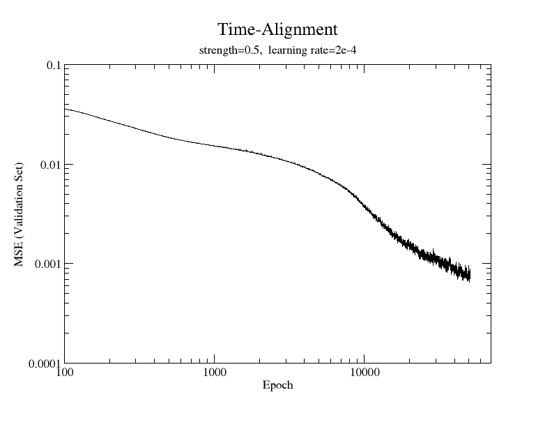
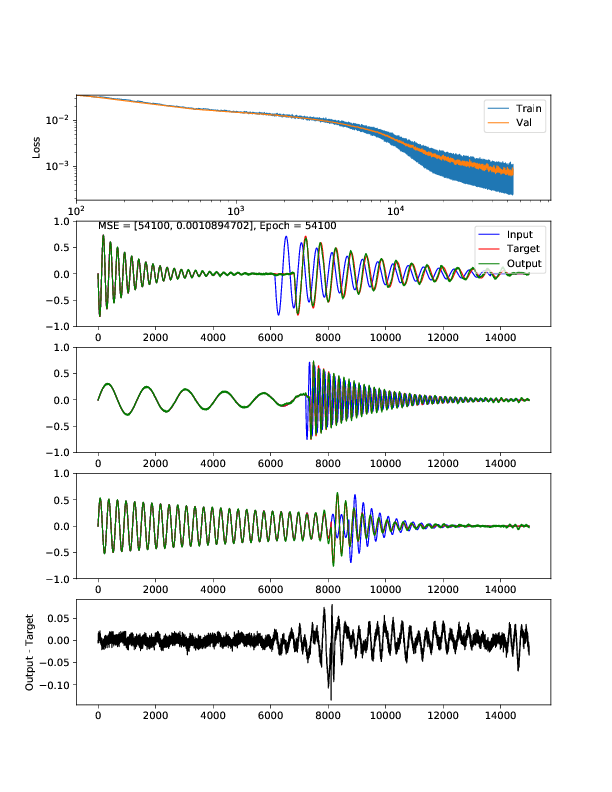

## Basic Overview
First attempt: with multiple, randomly-placed 'plucks'.  Red is "on the grid".

That seemed hard, so decided to focus on just one event, which 'should' be in the middle of window:

Ok, so that worked, so what about if it's not preceded by silence?  Here's noise:

...interesting that it doesn't learn the noise.  That's ok.

In reality, though, there will be a precding event.  In this case, interestingly, when the random event occurs too early, the newtork learns to **generate more of the preceding signal** to fill in the gap:

	

Obviously this is a function of how it was trained.  If it were trained on a dataset that did cross-fades, then presumably (I have yet to try this) it would learn to approximate a cross-fade.

Current maximum length I could get is 10500 samples, or around 230ms at 44.1Hz.  This is sufficient for most drum samples.  

***UPDATE: with skip connections (below), as well as wrapping the FNNAnalysis & FNNSynthesis routines with shrinking/growing layers before/after, allowed the size of each 'chunk' to be increased to 15000 samples, i.e. 340ms at 44.1kHz.  (Chunk size limit is mainly set by size of VRAM of NVIDIA Titan X GPU -- much larger and the model can't fit in VRAM.)***  

## Skip connections:

Added skip connections to the model; seems to have reached the same level of error as before, only gets there faster:

The best results (blue line above) were actually obtained by only using the "larger" 2 of the 3 skip connections I added.  The skip which spanned the "tiniest" part of the network didn't help much, but was also responsible for some high frequency noise.  Not including that skip helped reduced the noise (in the output waveforms, not shown).  I speculate that this skip was actually hindering the bottleneck-ing process of representation-learning, by providing a bypass. 

## Adding `strength` 'knob'

Instead of moving the erroneous event exactly 'onto the grid' (henceforth "OTG"), I introduced a tunable parameter `strength` for which
`strength=0` means leaving the event unedited, and `strength=1` means put it exactly on the grid.  Mathematically,
given the onset time of the input event, t_i, and the onset time of the fully-edited OTG version t_g,
we define the target time to be

`t_target = strength * t_g + (1 - strength) * t_i`

...i.e., strength linearly interpolates between the input time and the OTG time.  

**Results**: With the same learning rate as before, this is hard to do.  But if you reduce the learning rate, you can get some nice results (if you're willing to wait for them):

## Future work:

- Pass the strength parameter into the neural network model, e.g. concatenate it in the 'bottleneck' part of the network 
- Read in actual audio samples of drums
- For drum samples, having a pytorch Dataset class (e.g. via torchaudio) might be a good idea. 
